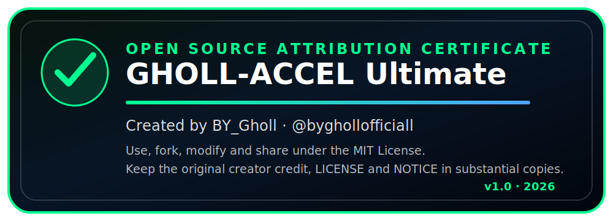

# GHOLL-ACCEL



**GHOLL-ACCEL**, **BY_Gholl** (`@byghollofficiall`) tarafından geliştirilen açık kaynaklı YouTube hız-ramp eklentisidir.

Bu repo artık **v1.0.0 Stable** ile başlıyor. Önceki yüksek sürüm numaraları geliştirme/prototip içindi; açık kaynak public sürüm numarası temiz şekilde `v1.0.0` oldu.

> Bu proje YouTube, Google, Chrome, Brave, Microsoft Edge, Mozilla Firefox veya Tampermonkey ile bağlantılı değildir.

## Klasör yapısı

```text
GHOLL_ACCEL_v1_0_0/
├─ development/
│  ├─ chrome/       # Chrome, Brave, Edge, Opera, Vivaldi için geliştirme kaynağı
│  └─ firefox/      # Firefox için geliştirme kaynağı
├─ releases/
│  └─ v1.0.0/       # GitHub Release / Store için hazır paket ZIP dosyaları
├─ docs/
├─ scripts/
├─ LICENSE
├─ NOTICE
└─ OPEN_SOURCE_CERTIFICATE.md
```

## Geliştirme ve release ayrımı

- `development/` klasörü kod yazmak, düzenlemek ve **Load unpacked** ile test etmek için.
- `releases/` klasörü hazır paketler için. GitHub Releases, Chrome Web Store veya Firefox AMO tarafına buradaki ZIP dosyaları verilir.

`releases/` içindeki dosyaları elle düzenleme. Kod değişikliği `development/` içinde yapılır, sonra build scriptiyle paket üretilir.

## Stable release paketleri

Mevcut stable sürüm: **v1.0.0**

```text
releases/v1.0.0/GHOLL-ACCEL-chromium-v1.0.0.zip
releases/v1.0.0/GHOLL-ACCEL-firefox-v1.0.0.zip
releases/v1.0.0/SHA256SUMS.txt
```

Chrome, Brave, Edge, Opera, Vivaldi ve Chromium tabanlı tarayıcılar için Chromium paketi kullanılır.

Firefox için Firefox paketi kullanılır.

## Ana özellikler

- Manifest V3 tarayıcı eklentisi.
- YouTube hız-ramp kontrolü.
- Modern sayfa içi kontrol paneli.
- Mini HUD.
- Presetler.
- Pause-aware timer.
- Video ileri/geri sarılınca hız/ramp devam eder.
- Video loop olunca hız/ramp devam eder.
- Sonraki videoya geçince hız/ramp devam eder.
- Ayar export/import/reset.
- Acil 1.0x reset.
- BY_Gholl atıflı MIT açık kaynak lisansı.

## Paket üretme

```bash
python scripts/build_release.py
```

Sadece doğrulama:

```bash
python scripts/build_release.py --validate-only
```

Script şunları üretir:

```text
releases/v1.0.0/GHOLL-ACCEL-chromium-v1.0.0.zip
releases/v1.0.0/GHOLL-ACCEL-firefox-v1.0.0.zip
releases/v1.0.0/SHA256SUMS.txt
```

## Geliştirme kurulumu

### Chrome / Brave / Edge

1. `chrome://extensions` veya `brave://extensions` aç.
2. Developer mode aç.
3. **Load unpacked** bas.
4. `development/chrome` klasörünü seç.

### Firefox

1. `about:debugging#/runtime/this-firefox` aç.
2. **Load Temporary Add-on** bas.
3. `development/firefox/manifest.json` dosyasını seç.

## Lisans

MIT License. Herkes kullanabilir, fork alabilir, değiştirebilir, paylaşabilir ve inceleyebilir. Yeter ki lisans ve BY_Gholl atfı kalsın.

Geliştirici: **BY_Gholl**.
